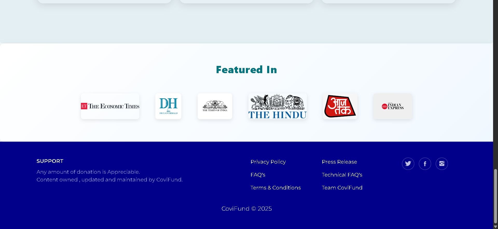
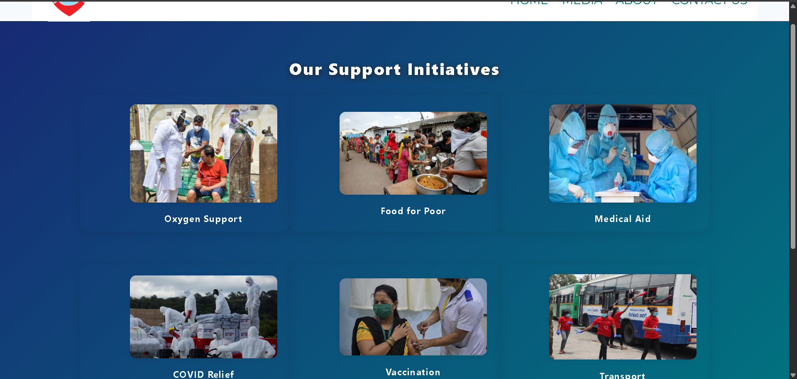
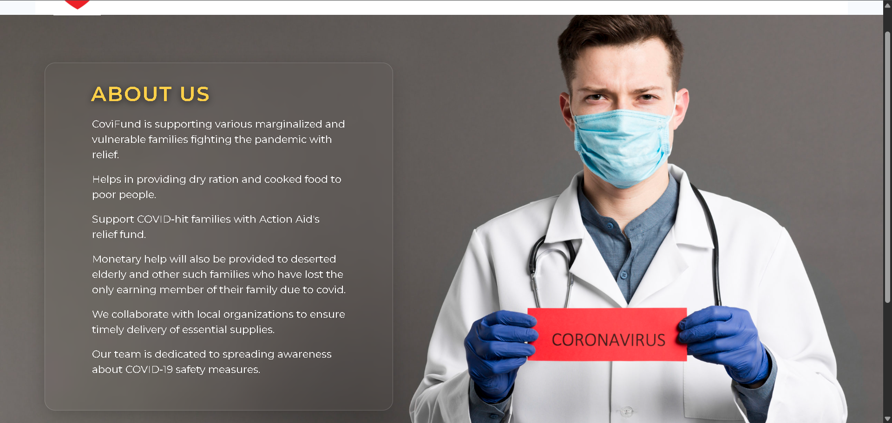

# CoviFund

## Project Overview

**CoviFund** is a full-stack web application designed as a prototype for integrating the RazorPay Payment Gateway to facilitate COVID-19 relief donations. The platform provides real-time COVID-19 statistics, showcases support initiatives, and enables secure online donations.

---

## Screenshots







---

## Tech Stack

- **Frontend:** HTML, CSS (custom + Bootstrap), JavaScript
- **Backend:** Node.js, Express.js
- **Templating:** EJS (Embedded JavaScript Templates)
- **APIs:** [Rootnet COVID-19 India API](https://api.rootnet.in/)
- **Payment Gateway:** RazorPay (Test Mode)
- **UI Libraries:** Bootstrap, AOS (Animate On Scroll)

---

## Features

### 1. **Live COVID-19 Data Integration**
- Fetches real-time COVID-19 statistics for India using the Rootnet API.
- Displays total cases, active cases, discharged, deaths, and last updated time.
- Data is shown in a glassmorphic card on the homepage.

### 2. **RazorPay Payment Gateway Integration**
- Secure donation flow using RazorPay’s hosted payment button.
- All donations are processed in test mode for demonstration.
- Prominent “Donate” section with call-to-action and payment button.

### 3. **Responsive UI & UX**
- Mobile-first, fully responsive layouts using Bootstrap and custom CSS.
- Glassmorphism and modern gradients for visual appeal.
- Animated elements with AOS for smooth user experience.

### 4. **Support Initiatives Showcase**
- `/ourSupport` page displays various relief initiatives (Oxygen Support, Food for Poor, Medical Aid, etc.) in a responsive card grid.
- Each card features an image, caption, and hover effects.

### 5. **Testimonials Carousel**
- Carousel component highlights testimonials and impact stories.
- Uses Bootstrap’s carousel with custom styling and controls.

### 6. **Press & Media Mentions**
- Dedicated section for press logos and media mentions.
- Responsive logo grid with hover effects.

### 7. **Contact & About Pages**
- Contact form with glassmorphic styling, email submission, and contact info.
- About page details the mission, approach, and relief activities.

### 8. **Reusable Components**
- Modular EJS partials for header, footer, navbar, testimonials, press, and donation section.
- Consistent branding and navigation across all pages.

### 9. **Accessibility & SEO**
- Semantic HTML structure.
- Proper alt text for images and ARIA labels for navigation.

---

## Project Structure

```
app.js
package.json
public/
  assets/
    bootstrap/
    css/
    fonts/
    img/
    js/
views/
  about.ejs
  contact.ejs
  home.ejs
  ourSupport.ejs
  components/
  partials/
```

- **`app.js`**: Express server, routing, API integration, and EJS rendering.
- **`public/`**: Static assets (CSS, JS, images, fonts).
- **`views/`**: EJS templates for all pages and components.

---

## How It Works

1. **Server Setup:**  
   Express serves static files and renders EJS templates.  
   COVID-19 data is fetched asynchronously on the home route and passed to the template.

2. **Donation Flow:**  
   Users click the RazorPay button, triggering the payment gateway in test mode.

3. **Navigation:**  
   Navbar links to Home, About, Media (Support), and Contact pages.

4. **UI Components:**  
   Testimonials and press sections are included as EJS components for reusability.

---

## Getting Started

1. **Install dependencies:**
   ```sh
   npm install
   ```
2. **Run the server:**
   ```sh
   node app.js
   ```
3. **Open in browser:**  
   Visit [http://localhost:3000](http://localhost:3000)

